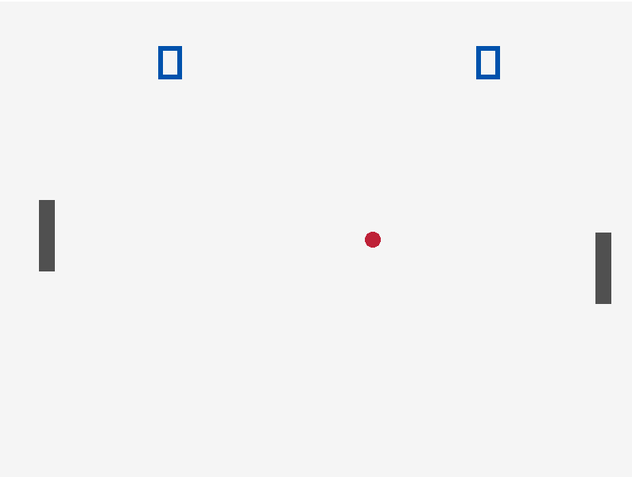

# Pong Clone made With Raylib
Written in C++

# Build Instructions:
1. Install Raylib using vcpkg
2. Clone the repo:  
`https://github.com/ThePlayerRolo/PongRayLib.git` 
3. Open Visual Studio 2022
4. Build Solution

# TODO:
* Change to CMake Build System
* Allow resizeable windows